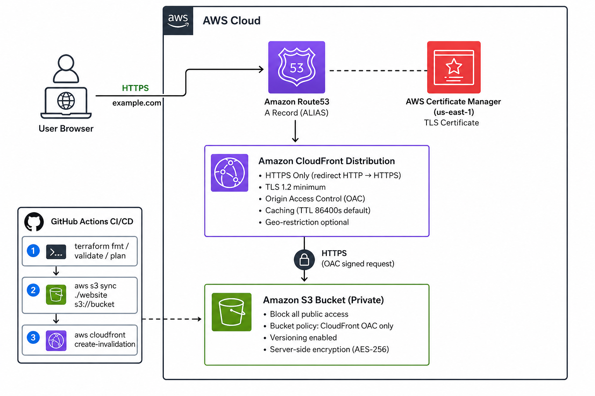
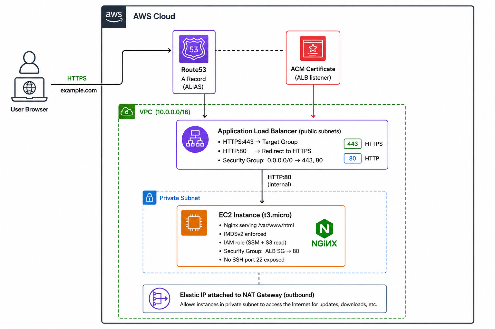

# quanta-aws-hosting

[](https://terraform.io)
[](https://aws.amazon.com)
[](https://github.com/musabe/quanta-aws-hosting/actions)
[](LICENSE)

Production-grade AWS website hosting implemented with Terraform, across two AWS accounts, with automated GitHub Actions CI/CD, HTTPS, DNS, and security best practices. This repository exists as a production-oriented infrastructure reference demonstrating Terraform module design, multi-account AWS deployment, CI/CD automation, and modern security controls.

---

## 🏆 Highlights

- Two AWS hosting architectures — serverless-static and traditional-compute
- Multi-account Terraform deployment (dev / prod isolation)
- GitHub Actions OIDC federation — no long-lived AWS credentials
- CloudFront Origin Access Control (OAC) — replaces deprecated OAI
- IMDSv2 enforced on all EC2 instances
- SSM Session Manager — no SSH port 22 exposure
- Terraform remote state with S3 backend and DynamoDB locking
- Automated rollback via S3 versioning
- PR-gated Terraform plans and manual approval gate for production

---

## 🌍 Environments

| Environment | Account | Domain | Profile |
|-------------|---------|--------|---------|
| **prod** | `111111111111` | `quantaweb.dev` | `quanta-web-prod` |
| **dev** | `222222222222` | `quantadev.dev` | `quanta-web-dev` |

---

## ☁️ Solutions

| Solution | Architecture | Dev URL | Prod URL |
|----------|-------------|---------|----------|
| **A** | S3 + CloudFront + ACM + Route53 | `https://quantadev.dev` | `https://quantaweb.dev` |
| **B** | EC2 + Nginx + ALB + ACM + Route53 | `https://ec2.quantadev.dev` | `https://ec2.quantaweb.dev` |

### Solution A — S3 + CloudFront



### Solution B — EC2 + Nginx + ALB



> [!NOTE]
> CloudFront ACM certificates must be created in `us-east-1` regardless of deployment region.

---

## 🏗️ Architecture Decisions

**Solution A (S3 + CloudFront)** was selected for its near-zero operational overhead, global CDN delivery via 400+ edge locations, and serverless static hosting model. It demonstrates CloudFront OAC, ACM DNS validation, and S3 security hardening.

**Solution B (EC2 + ALB + Nginx)** was selected to demonstrate VPC design, ALB TLS termination, IAM instance profiles, security group layering, and traditional compute hosting patterns.

Together, the two solutions intentionally cover the full spectrum from serverless-static to traditional-compute deployment models, demonstrating architectural range.

| Solution | Cost/month | Scalability | Ops Complexity |
|----------|-----------|-------------|----------------|
| S3 + CloudFront | ~$1–15 | Infinite | Low |
| EC2 + ALB | ~$25–45 | Manual/ASG | Medium |

---

## 🔐 Security Highlights

- **GitHub Actions OIDC federation** — short-lived tokens, no stored access keys
- **IMDSv2 enforced** on EC2 — mitigates SSRF credential theft
- **SSM Session Manager** — management access without SSH or port 22
- **CloudFront OAC** — S3 access pinned to a specific distribution ARN
- **TLS 1.2+ / TLS 1.3** enforced on both CloudFront and ALB
- **Private subnets** for EC2 — no direct internet exposure
- **Separate AWS accounts** — blast radius containment between dev and prod

> [!IMPORTANT]
> GitHub OIDC federation removes the need for long-lived AWS access keys in CI/CD.

---

## 🔄 Remote State

Terraform remote state is stored in S3 with DynamoDB locking per environment:

- **Backend**: S3 bucket with AES-256 encryption and versioning enabled
- **Locking**: DynamoDB table (`PAY_PER_REQUEST`) prevents concurrent apply conflicts
- **Isolation**: Separate state files per environment (`dev/solution-a`, `prod/solution-b`, etc.)

---

## 🚀 Quick Start

### 1 — Bootstrap (run once per account)

```powershell
# Dev account
.\scripts\bootstrap.ps1 -Environment dev

# Prod account
.\scripts\bootstrap.ps1 -Environment prod
```

### 2 — Add GitHub Secrets

Go to **Settings → Secrets → Actions** and add:

| Secret | Value |
|--------|-------|
| `AWS_ROLE_ARN_DEV` | IAM role ARN from dev bootstrap output |
| `AWS_ROLE_ARN_PROD` | IAM role ARN from prod bootstrap output |

### 3 — Deploy

```powershell
# Solution A — dev
cd environments/dev/solution-a
terraform init && terraform apply

# Solution B — dev
cd environments/dev/solution-b
terraform init && terraform apply
```

---

## 📁 Repository Structure

```
quanta-aws-hosting/
├── .github/workflows/
│   ├── terraform-ci.yml          # PR validation — fmt, validate, plan
│   ├── deploy-solution-a.yml     # S3 + CloudFront deployment
│   └── deploy-solution-b.yml     # EC2 + Nginx deployment
├── bootstrap/                    # Remote state + OIDC setup (run once)
├── modules/
│   ├── s3-cloudfront/            # CloudFront distribution + S3 + OAC
│   ├── ec2-nginx/                # EC2 + ALB + security groups
│   ├── acm/                      # ACM certificate + DNS validation
│   ├── route53/                  # ALIAS DNS records
│   └── vpc/                      # VPC + public/private subnets + NAT
├── environments/
│   ├── dev/
│   │   ├── solution-a/           # quantadev.dev
│   │   └── solution-b/           # ec2.quantadev.dev
│   └── prod/
│       ├── solution-a/           # quantaweb.dev
│       └── solution-b/           # ec2.quantaweb.dev
├── website/
│   ├── solution-a/               # Static site content
│   └── solution-b/               # Nginx site content
├── scripts/
│   ├── bootstrap.ps1
│   └── deploy.ps1
└── docs/
    ├── Architecture.md
    ├── Deployment.md
    ├── Security.md
    └── Troubleshooting.md
```

---

## 🔁 CI/CD Flow

```
feature/* → PR → develop   →  deploy to dev   (automatic)
develop   → PR → main      →  deploy to prod  (manual approval gate)
```

Pull requests trigger `terraform fmt`, `validate`, and `plan` automatically. Plans are posted as PR comments.

---

## 📖 Documentation

| Document | Description |
|----------|-------------|
| [Architecture.md](docs/Architecture.md) | Architecture evaluation, decisions, and diagrams |
| [Deployment.md](docs/Deployment.md) | Step-by-step deployment, rollback, and CI/CD guide |
| [Security.md](docs/Security.md) | Security controls, IAM strategy, and threat model |
| [Troubleshooting.md](docs/Troubleshooting.md) | Common issues and operational debugging workflows |
